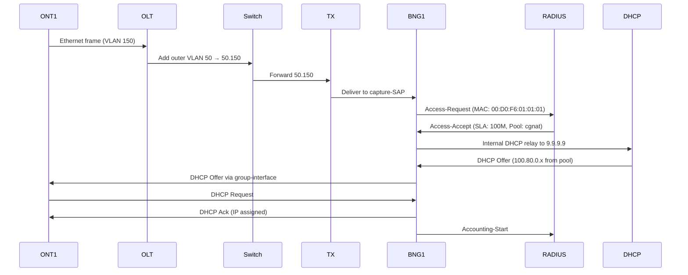
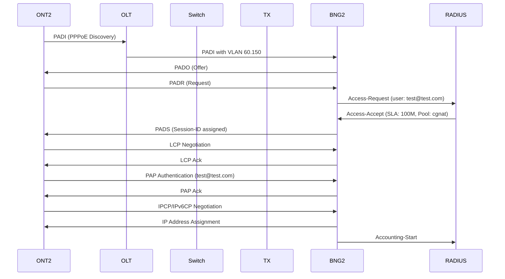

## Subscriber Connection Flows

The lab demonstrates two primary subscriber connection methods: **IPoE (DHCP-based)** and **PPPoE (PPP over Ethernet)**. Each method follows a distinct authentication and IP assignment flow.

## IPoE Subscriber Flow (ONT1 → BNG1)

<Note>
IPoE provides DHCP-based connectivity without PPP encapsulation, commonly used for simplified provisioning and high-performance residential services.
</Note>

### Connection Establishment



### Step-by-Step Flow

<Accordion title="1. Initial Layer 2 Connection">
**Action**: ONT1 sends Ethernet frames on eth1 with VLAN 150

**Details**:
- ONT1 MAC: 00:D0:F6:01:01:01
- VLAN: 150 (single tag)
- Destination: Broadcast (FF:FF:FF:FF:FF:FF) for DHCP Discover

**Path**: ONT1 eth1 → OLT port 1/1/2
</Accordion>

<Accordion title="2. VLAN Encapsulation (QinQ)">
**Action**: OLT adds outer VLAN 50 for BNG1 service identification

**VPLS Configuration**:
```
service vpls "bng1-agg" service-id 50
  sap 1/1/1:50.150 (uplink to Switch - double tagged)
  sap 1/1/2:150 (ONT1 - single tagged)
```

**Result**: Frame becomes 50.150 (outer.inner VLAN)

**Path**: OLT 1/1/1 → Switch 1/1/3
</Accordion>

<Accordion title="3. Transport Switching">
**Action**: Switch forwards double-tagged traffic transparently

**VPLS Configuration**:
```
service vpls "to-tx-50" service-id 50
  sap 1/1/3:50.* (from OLT)
  sap 1/1/1:50.* (to TX)
```

**Path**: Switch 1/1/1 → TX ethernet-1/3 → TX ethernet-1/1 → BNG1 1/1/c1/1
</Accordion>

<Accordion title="4. BNG Capture-SAP Matching">
**Action**: BNG1 matches incoming traffic via wildcard capture-SAP

**Configuration**:
```
service vpls "capture-sap" service-id 2
  capture-sap 1/1/c1/1:*.* msap-policy "msap"
  radius-auth-policy "autpolicy"
```

**Behavior**:
- Matches any VLAN tags (*.* wildcard)
- Triggers MSAP (Managed SAP) creation
- Initiates RADIUS authentication
</Accordion>

<Accordion title="5. RADIUS Authentication">
**Action**: BNG1 sends RADIUS Access-Request for MAC-based authentication

**RADIUS Attributes Sent**:
- **User-Name**: MAC address (Calling-Station-Id)
- **MAC-Address**: 00:d0:f6:01:01:01
- **NAS-Identifier**: BNG1 system name
- **NAS-IP-Address**: 10.77.1.2
- **NAS-Port-Id**: 1/1/c1/1:50.150
- **Called-Station-Id**: SAP identifier

**RADIUS Server Response** (`authorize` file):
```
00:d0:f6:01:01:01   Cleartext-Password := "testlab123"
    Framed-Pool = "cgnat",
    Framed-IPv6-Pool = "IPv6",
    Alc-Delegated-IPv6-Pool = "IPv6",
    Alc-SLA-Prof-str = "100M",
    Alc-Subsc-Prof-str = "subprofile",
    Alc-Subsc-ID-Str = "ONT-001"
```

**Result**: Subscriber authenticated with profile assignment
</Accordion>

<Accordion title="6. Dynamic Subscriber Interface Creation">
**Action**: BNG1 creates dynamic subscriber host under VPRN 9998

**Configuration Context**:
```
vprn 9998
  subscriber-interface "services"
    group-interface "gi"
      ipoe-session policy "ipoe"
      dhcp admin-state enable
      dhcp server [9.9.9.9]
```

**Created Objects**:
- Dynamic managed SAP: 1/1/c1/1:50.150
- Subscriber ID: ONT-001
- SLA Profile: 100M (100 Mbps rate limit)
- Sub Profile: subprofile (accounting enabled)
</Accordion>

<Accordion title="7. DHCP IP Assignment">
**Action**: BNG1 acts as DHCP server and assigns IP from pool

**DHCP Server Configuration**:
```
dhcp-server dhcpv4 "suscriptores"
  pool "cgnat"
    subnet 100.80.0.0/29
      address-range 100.80.0.2 end 100.80.0.7
      default-router 100.80.0.1
      dns-server 8.8.8.8, 8.8.4.4
      lease-time 315446399 (max)
```

**DHCPv6 for Prefix Delegation**:
```
dhcp-server dhcpv6 "suscriptores_v6"
  pool "IPv6"
    prefix 2001:db8:100::/56 (WAN host)
    prefix 2001:db8:200::/48 (PD for LAN)
```

**Assigned Addresses**:
- IPv4: 100.80.0.x (NAT inside)
- IPv6 WAN: 2001:db8:100::xxxx/64
- IPv6 PD: 2001:db8:200:x::/56 (delegated to ONT1)
</Accordion>

<Accordion title="8. RADIUS Accounting Start">
**Action**: BNG1 sends Accounting-Start message

**Accounting Attributes**:
- **Acct-Status-Type**: Start
- **Acct-Session-Id**: Unique session identifier
- **Framed-IP-Address**: 100.80.0.x
- **Delegated-IPv6-Prefix**: 2001:db8:200:x::/56
- **NAS-Port-Id**: 1/1/c1/1:50.150
- **Acct-Authentic**: RADIUS

**Result**: Session tracked for billing and analytics
</Accordion>

### Traffic Flow After Connection

**Upstream (ONT1 → Internet)**:
1. ONT1 sends packet with source 100.80.0.x
2. BNG1 applies NAT filter (ip-filter "10")
3. NAT44 translates 100.80.0.x → 99.99.99.99:port_block
4. Packet routed via VPRN 9999 to iPerf (172.19.1.1)

**Downstream (Internet → ONT1)**:
1. Packet arrives at 99.99.99.99:port
2. BNG1 NAT reverses translation → 100.80.0.x
3. Forwarded via group-interface "gi" to subscriber
4. Encapsulated with VLANs 50.150
5. Delivered to ONT1 via OLT

## PPPoE Subscriber Flow (ONT2 → BNG2)

<Note>
PPPoE uses PPP protocol for authentication and encapsulation, providing per-session control and traditional ISP authentication methods (PAP/CHAP).
</Note>

### Connection Establishment



### Step-by-Step Flow

<Accordion title="1. PPPoE Discovery Phase (PADI)">
**Action**: ONT2 broadcasts PPPoE Active Discovery Initiation

**Details**:
- **Frame**: Ethernet Type 0x8863 (PPPoE Discovery)
- **MAC Source**: 00:D0:F6:01:01:02
- **MAC Dest**: FF:FF:FF:FF:FF:FF (broadcast)
- **VLAN**: 150
- **Service-Name**: Any (empty tag)

**Path**: ONT2 eth1 → OLT 1/1/3 → (VLAN 60.150 added) → BNG2
</Accordion>

<Accordion title="2. PPPoE Discovery Offer (PADO)">
**Action**: BNG2 responds with unicast PADO

**BNG2 Configuration**:
```
group-interface "gi"
  pppoe admin-state enable
  pppoe policy "pppoe"
  pppoe session-limit 131071
  pppoe user-db "clientes"
```

**PADO Content**:
- **AC-Name**: BNG2 system name
- **Service-Name**: Echoed from PADI
- **AC-Cookie**: Session state tracking

**Result**: ONT2 receives offer from BNG2
</Accordion>

<Accordion title="3. PPPoE Discovery Request (PADR)">
**Action**: ONT2 selects BNG2 and sends PADR

**PADR Content**:
- **Service-Name**: Selected service
- **AC-Cookie**: From PADO
- **Host-Uniq**: ONT2 tracking tag

**Triggers**: BNG2 initiates RADIUS authentication
</Accordion>

<Accordion title="4. RADIUS Authentication (PPPoE Credentials)">
**Action**: BNG2 sends Access-Request with PPPoE username/password

**RADIUS Attributes**:
- **User-Name**: test@test.com
- **User-Password**: testlab123 (encrypted)
- **NAS-Identifier**: BNG2
- **NAS-IP-Address**: 10.77.1.3
- **NAS-Port-Id**: 1/1/c1/1:60.150
- **Service-Type**: Framed
- **Framed-Protocol**: PPP
- **Calling-Station-Id**: 00:d0:f6:01:01:02

**RADIUS Response**:
```
"test@test.com" Cleartext-Password := "testlab123"
    Framed-Pool = "cgnat",
    Framed-IPv6-Pool = "IPv6",
    Alc-Delegated-IPv6-Pool = "IPv6",
    Alc-SLA-Prof-str = "100M",
    Alc-Subsc-Prof-str = "subprofile",
    Alc-Subsc-ID-Str = "ONT-002-PPPOE"
```

**Result**: Authentication successful, profiles assigned
</Accordion>

<Accordion title="5. PPPoE Session Establishment (PADS)">
**Action**: BNG2 confirms session with PADS

**PADS Content**:
- **Session-ID**: Unique 16-bit identifier
- **AC-Cookie**: Confirmed

**Result**: PPPoE session active, transitions to PPP phase
</Accordion>

<Accordion title="6. LCP Negotiation">
**Action**: Link Control Protocol establishes PPP link parameters

**PPP Policy Configuration**:
```
ppp-policy "pppoe"
  ppp-authentication pref-pap
  ppp-initial-delay true
  ppp-mtu 1500
  keepalive interval 10
  keepalive hold-up-multiplier 4
```

**Negotiated Parameters**:
- **MRU**: 1492 (MTU - PPPoE overhead)
- **Authentication**: PAP selected
- **Magic Number**: Loop detection

**Result**: Link established, ready for authentication
</Accordion>

<Accordion title="7. PAP Authentication">
**Action**: PAP (Password Authentication Protocol) validates credentials

**Flow**:
1. ONT2 sends PAP Auth-Request (username: test@test.com, password: testlab123)
2. BNG2 validates against RADIUS response (already cached)
3. BNG2 sends PAP Auth-Ack

**Note**: CHAP is also supported via `pap-chap` configuration
</Accordion>

<Accordion title="8. IPCP and IPv6CP Negotiation">
**Action**: IP Control Protocol assigns IP addresses

**IPCP (IPv4)**:
- BNG2 assigns IP from DHCP pool 100.90.0.0/29
- ONT2 receives: 100.90.0.x
- DNS servers: 8.8.8.8, 8.8.4.4

**IPv6CP (IPv6)**:
- Interface ID negotiation
- RA (Router Advertisement) triggers DHCPv6-PD
- ONT2 receives: 2001:db8:100::xxxx/64 (WAN)
- Prefix Delegation: 2001:db8:200:x::/56 (LAN)

**Configuration**:
```
group-interface "gi"
  ipv6 router-advertisements admin-state enable
  ipv6 router-advertisements options managed-configuration true
  dhcp6 relay admin-state enable
  dhcp6 relay server ["fd07:47::aaaa"]
```
</Accordion>

<Accordion title="9. RADIUS Accounting Start">
**Action**: BNG2 sends Accounting-Start for session tracking

**Accounting-Request Attributes**:
- **Acct-Status-Type**: Start
- **User-Name**: test@test.com
- **Acct-Session-Id**: Unique session ID
- **Framed-IP-Address**: 100.90.0.x
- **Framed-Protocol**: PPP
- **Service-Type**: Framed
- **NAS-Port-Id**: 1/1/c1/1:60.150

**Accounting Policy**:
```
radius-accounting-policy "accounting"
  session-accounting admin-state enable
  interim-update true
  update-interval 720 (12 minutes)
```
</Accordion>

### PPPoE Traffic Encapsulation

**Upstream (ONT2 → Internet)**:
```
[Ethernet Header]
  MAC Src: 00:D0:F6:01:01:02
  MAC Dst: BNG2 MAC
  VLAN: 150
[PPPoE Header]
  Session-ID: 0x1234
  Protocol: 0x0021 (IPv4) or 0x0057 (IPv6)
[PPP Header]
[IP Packet]
  Src: 100.90.0.x
  Dst: 172.20.1.1 (iPerf)
```

**NAT Translation** (BNG2 VPRN 9999):
- Inside: 100.90.0.x
- Outside: 100.100.100.100:port_block
- Deterministic port allocation (64 ports per subscriber)

## RADIUS Authentication Flow

### Access-Request Sequence

<Accordion title="BNG → RADIUS Communication">
**Transport**:
- **Protocol**: UDP
- **Port**: 1812 (authentication), 1813 (accounting)
- **Source**: BNG mgmt IP (10.77.1.2 or 10.77.1.3)
- **Destination**: RADIUS server (10.77.1.10)
- **Router Instance**: management VRF

**Configuration**:
```
router "management" radius server "radius"
  address 10.77.1.10
  secret testlab123
  accept-coa true

aaa radius server-policy "radius_policy"
  retry-count 5
  router-instance "management"
  source-address 10.77.1.2 (or 10.77.1.3)
```
</Accordion>

<Accordion title="RADIUS Attribute Mapping">
**Authentication Policy Includes**:
```
radius-authentication-policy "autpolicy"
  include-radius-attribute:
    - access-loop-options
    - called-station-id
    - dhcp-options
    - mac-address
    - nas-identifier
    - remote-id
    - circuit-id
    - nas-port-id
    - nas-port-type
```

**Accounting Policy Includes**:
```
radius-accounting-policy "accounting"
  include-radius-attribute:
    - framed-ip-address
    - framed-ipv6-prefix
    - delegated-ipv6-prefix
    - nat-port-range
    - sla-profile
    - sub-profile
    - subscriber-id
    - tunnel-server-attrs
    - acct-triggered-reason
```
</Accordion>

<Accordion title="VSA (Vendor-Specific Attributes)">
**Nokia/Alcatel-Lucent VSAs**:
- **Alc-SLA-Prof-str**: "100M" → Maps to SLA profile
- **Alc-Subsc-Prof-str**: "subprofile" → Maps to subscriber profile
- **Alc-Subsc-ID-Str**: Subscriber identifier
- **Alc-Delegated-IPv6-Pool**: IPv6 PD pool name

**Usage**: Assigns per-subscriber QoS, accounting, and IP pool policies
</Accordion>

### RADIUS CoA (Change of Authorization)

<Info>
Both BNGs support **RFC 5176 CoA** for dynamic subscriber management without session termination.
</Info>

**Enabled Configuration**:
```
router "management" radius server "radius"
  accept-coa true
```

**Use Cases**:
- Bandwidth profile changes (SLA updates)
- Subscriber re-authentication
- Service activation/deactivation
- Policy updates

## DHCPv4 Flow

### DHCP Server Architecture

<Accordion title="Internal DHCP Server (BNG-local)">
**Configuration Location**: VPRN 9998 (NAT inside)

**DHCPv4 Server**:
```
dhcp-server dhcpv4 "suscriptores"
  admin-state enable
  pool "cgnat"
    subnet 100.80.0.0/29 (BNG1) or 100.90.0.0/29 (BNG2)
      address-range .2 to .7
      default-router .1
      dns-server 8.8.8.8, 8.8.4.4
      lease-time 315446399 (max)
```

**Loopback Interface** (DHCP server address):
```
interface "loopback"
  ipv4 local-dhcp-server "suscriptores"
  ipv4 address 9.9.9.9/32
```

**Benefit**: Local DHCP for fast response, no external dependency
</Accordion>

<Accordion title="DHCP Proxy Functionality">
**Group-Interface Configuration**:
```
group-interface "gi"
  ipv4 dhcp admin-state enable
  ipv4 dhcp server [9.9.9.9]
  ipv4 dhcp gi-address 100.80.0.1
  ipv4 dhcp proxy-server admin-state enable
  ipv4 dhcp proxy-server emulated-server 100.80.0.1
  ipv4 dhcp lease-populate max-leases 131071
```

**Function**:
- BNG intercepts DHCP broadcasts
- Relays to internal server 9.9.9.9
- Responds from gi-address (subscriber gateway)
- Populates routing table with /32 host routes
</Accordion>

### DHCP Message Flow (IPoE)

```
ONT1                 BNG1 (gi)           BNG1 (loopback)
  |                     |                     |
  |-- DHCP Discover --->|                     |
  |   (broadcast)       |--- Relay to ------->|
  |                     |    9.9.9.9          |
  |                     |<--- DHCP Offer -----||
  |<--- DHCP Offer -----|                     |
  |   (from 100.80.0.1) |                     |
  |                     |                     |
  |--- DHCP Request --->|                     |
  |                     |--- Relay to ------->|
  |                     |<--- DHCP Ack -------|
  |<--- DHCP Ack -------|                     |
  |   IP: 100.80.0.x    |                     |
  |   GW: 100.80.0.1    |                     |
```

**Option 82 (Circuit-ID/Remote-ID)**:
- Inserted by BNG to identify subscriber location
- Used for RADIUS authentication correlation

## DHCPv6 Flow

### DHCPv6 Relay and Server

<Accordion title="DHCPv6 Server Configuration">
**Server Location**: VPRN 9998 loopback

```
dhcp-server dhcpv6 "suscriptores_v6"
  admin-state enable
  pool "IPv6"
    prefix 2001:db8:100::/56 (WAN host assignments)
      prefix-type wan-host true
      prefix-type pd false
    prefix 2001:db8:200::/48 (Prefix Delegation)
      prefix-type wan-host false
      prefix-type pd true
      delegated-prefix minimum 56
      delegated-prefix maximum 64
    dns-server 2001:4860:4860::8888, 2001:4860:4860::8844
```

**Loopback Address**: fd07:47::aaaa/128
</Accordion>

<Accordion title="DHCPv6 Relay Configuration">
**Group-Interface Setup**:
```
group-interface "gi"
  ipv6 dhcp6 relay admin-state enable
  ipv6 dhcp6 relay link-address 2001:db8:100::
  ipv6 dhcp6 relay server ["fd07:47::aaaa"]
  ipv6 dhcp6 proxy-server admin-state enable
  ipv6 dhcp6 pd-managed-route
```

**Router Advertisements**:
```
ipv6 router-advertisements admin-state enable
ipv6 router-advertisements options managed-configuration true
ipv6 router-advertisements prefix-options autonomous false
```

**Result**: Stateful DHCPv6 for both WAN addressing and Prefix Delegation
</Accordion>

### DHCPv6-PD Message Flow

```
ONT1/2               BNG (gi)            BNG (loopback)
  |                     |                     |
  |<-- RA (M-flag) -----|                     |
  |   (managed config)  |                     |
  |                     |                     |
  |-- Solicit (PD) ---->|                     |
  |                     |--- Relay-Forward -->|
  |                     |<-- Relay-Reply -----|
  |<-- Advertise -------|                     |
  |   (prefix offer)    |                     |
  |                     |                     |
  |-- Request (PD) ---->|                     |
  |                     |--- Relay-Forward -->|
  |                     |<-- Relay-Reply -----|
  |<-- Reply ----------|                     |
  |   2001:db8:200:x::/56                    |
```

**Delegated Prefix Routing**:
- BNG installs subscriber route: 2001:db8:200:x::/56 → subscriber host
- ONT receives /56 or /60 prefix for LAN subnetting
- SLAAC on ONT LAN interface advertises prefix to PC1

## NAT Flows

### Deterministic NAT44 Architecture

<Note>
Both BNGs use **RFC 6598 deterministic NAT** with fixed port block assignment for auditability and CGNAT compliance.
</Note>

<Accordion title="NAT Configuration (BNG1 Example)">
**ISA (Integrated Services Adapter)**:
```
isa nat-group 1
  admin-state enable
  active-mda-limit 1
  mda 2/1 (ISA2-bb hardware)
```

**NAT Outside Pool** (VPRN 9999):
```
vprn "9999" nat outside pool "dtpool"
  type large-scale
  nat-group 1
  mode napt (NAPT - port translation)
  large-scale subscriber-limit 8
  large-scale deterministic port-reservation 64
  address-range 99.99.99.99 end 99.99.99.99
```

**NAT Inside Configuration** (VPRN 9998):
```
vprn "9998" nat inside large-scale nat44
  max-subscriber-limit 8
  deterministic prefix-map 100.80.0.0/29 nat-policy "natpol"
    map 100.80.0.0 to 100.80.0.7
    first-outside-address 99.99.99.99
```

**NAT Policy**:
```
nat nat-policy "natpol"
  pool router-instance "9999" name "dtpool"
  alg pptp true
  alg rtsp true
  alg sip true
```
</Accordion>

<Accordion title="Port Block Allocation">
**Deterministic Formula**:
- **Public IP**: 99.99.99.99
- **Total Ports**: 65,536
- **Reserved Ports**: 0-1023 (excluded)
- **Subscriber Limit**: 8 per IP
- **Ports per Subscriber**: 64

**Example Allocation**:
| Subscriber IP | Port Block |
|--------------|------------|
| 100.80.0.2 | 1024-1087 |
| 100.80.0.3 | 1088-1151 |
| 100.80.0.4 | 1152-1215 |
| 100.80.0.5 | 1216-1279 |
| ... | ... |

**Benefit**: Fixed mapping enables logging correlation and abuse tracking
</Accordion>

<Accordion title="NAT Filter Application">
**IP Filter "10" (applied in SLA profile)**:
```
filter ip-filter "10"
  entry 1 match dst-ip 100.80.0.0/29
    action accept (inside-to-inside traffic)
  entry 2 match src-ip 100.80.0.0/29
    action nat (trigger NAT translation)
```

**Applied in SLA Profile**:
```
sla-profile "100M"
  ingress ip-filter "10"
```

**Result**: All outbound subscriber traffic (not destined to NAT pool) triggers NAT44
</Accordion>

### NAT Translation Flow

**Upstream (Inside → Outside)**:
```
1. ONT1 sends: 100.80.0.2:54321 → 172.19.1.1:5001
2. Hits NAT filter entry 2 (src-ip match)
3. ISA translates: 100.80.0.2:54321 → 99.99.99.99:1050
4. Forwarded via VPRN 9999 interface "to_iperf"
5. Egress: 99.99.99.99:1050 → 172.19.1.1:5001
```

**Downstream (Outside → Inside)**:
```
1. iPerf responds: 172.19.1.1:5001 → 99.99.99.99:1050
2. BNG1 lookup: 99.99.99.99:1050 → subscriber 100.80.0.2
3. ISA translates: 99.99.99.99:1050 → 100.80.0.2:54321
4. Forwarded via VPRN 9998 group-interface "gi"
5. Delivered to ONT1 via subscriber host route
```

## Traffic Routing Between ISPs

### Independent NAT Pools

<Info>
**BNG1 and BNG2 operate completely independent NAT instances** with different public IP ranges and isolated routing domains.
</Info>

**BNG1**:
- NAT pool: 99.99.99.99
- iPerf route: 172.19.1.2 → 172.19.1.1
- Inside pool: 100.80.0.0/29

**BNG2**:
- NAT pool: 100.100.100.100
- iPerf route: 172.20.1.2 → 172.20.1.1
- Inside pool: 100.90.0.0/29

### iPerf Multi-Homing

**iPerf Network Configuration**:
```
eth1: 172.19.1.1/30 (BNG1 connection)
eth2: 172.20.1.1/30 (BNG2 connection)
default route: via 172.19.1.2 (BNG1)
```

**Traffic Flow**:
- BNG1 subscribers use 172.19.1.0/30 path
- BNG2 subscribers use 172.20.1.0/30 path
- Return traffic via same path (no asymmetric routing)

## Telemetry Data Flow

### gNMI Streaming Architecture

<Accordion title="gNMI Subscription Model">
**gNMIc Configuration** (`configs/gnmic/config.yml`):
```yaml
targets:
  bng1:
    address: 10.77.1.2:57400
    username: admin
    password: lab123
    insecure: true
  bng2:
    address: 10.77.1.3:57400
  switch:
    address: 10.77.1.4:57400
  olt:
    address: 10.77.1.5:57400

subscriptions:
  - name: interface_stats
    paths:
      - /state/port/statistics
      - /state/router/interface/statistics
    mode: sample
    interval: 10s
  - name: subscriber_stats
    paths:
      - /state/subscriber-mgmt/statistics
    mode: sample
    interval: 30s
```

**Benefit**: Real-time streaming eliminates SNMP polling overhead
</Accordion>

<Accordion title="Data Pipeline">
**Flow**:
```
BNG1/2 (gRPC:57400)
    |
    v
gNMIc Collector (10.77.1.12)
    | (Prometheus exporter format)
    v
Prometheus (10.77.1.13:9090)
    | (PromQL queries)
    v
Grafana Dashboards (10.77.1.14:3030)
```

**Metrics Collected**:
- **Interface counters**: in-octets, out-octets, errors, discards
- **Subscriber stats**: active sessions, setup rate, teardown rate
- **NAT stats**: translations, pool utilization, errors
- **System metrics**: CPU, memory, temperature
- **RADIUS stats**: auth success/fail, accounting packets
</Accordion>

<Accordion title="BNG gNMI Configuration">
**Enabled on all Nokia devices**:
```
system grpc
  admin-state enable
  allow-unsecure-connection
  gnmi auto-config-save true
```

**gRPC Port**: 57400 (default Nokia SR OS)

**Security**: Insecure mode for lab (production requires TLS)
</Accordion>

### Prometheus Scraping

**Prometheus Configuration** (`configs/prometheus/prometheus.yml`):
```yaml
scrape_configs:
  - job_name: 'gnmic'
    static_configs:
      - targets: ['gnmic:9804']
    scrape_interval: 15s
```

**Metrics Endpoint**: http://10.77.1.12:9804/metrics

**Retention**: Configurable (default 15 days)

### Grafana Visualization

**Datasource**: Prometheus (http://prometheus:9090)

**Pre-configured Dashboards**:
- BNG subscriber overview
- Interface utilization
- NAT pool status
- System health

**Access**: http://localhost:3030 (admin/admin)

## Flow Summary

### IPoE Subscriber (ONT1 → BNG1)
1. MAC-based RADIUS authentication
2. DHCP IP assignment from internal server
3. Deterministic NAT44 with fixed port block
4. Dual-stack IPv4 + IPv6-PD

### PPPoE Subscriber (ONT2 → BNG2)
1. PPPoE discovery (PADI/PADO/PADR/PADS)
2. PAP authentication via RADIUS
3. IPCP/IPv6CP address negotiation
4. Same NAT and routing as IPoE

### RADIUS Flow
1. Access-Request with subscriber attributes
2. Access-Accept with VSA profiles
3. Accounting-Start/Interim/Stop
4. CoA support for dynamic changes

### Telemetry Flow
1. gNMI subscriptions from gNMIc
2. Real-time metric streaming
3. Prometheus storage and aggregation
4. Grafana dashboard visualization

<Info>
All flows maintain **service isolation** via VLAN separation, independent NAT pools, and per-ISP routing policies.
</Info>