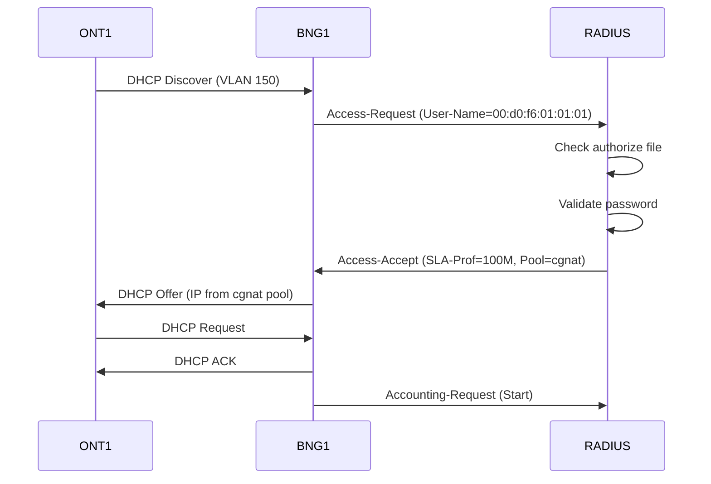
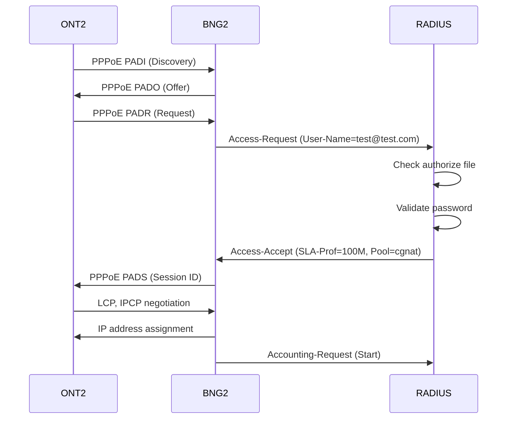

# RADIUS Server Configuration

The Nokia BNG Lab uses FreeRADIUS to provide Authentication, Authorization, and Accounting (AAA) services for subscriber sessions. The RADIUS server authenticates both IPoE (DHCP-based) and PPPoE subscribers.

## Server Overview

**Container Type:** Linux (network-multitool)

**Management IP:** 10.77.1.10

**RADIUS Software:** FreeRADIUS 3.0.26

**Configuration Location:** `/etc/raddb/`

**Log Location:** `/var/log/radius/`

## RADIUS Client Configuration

The RADIUS server must trust the BNG devices before accepting authentication requests:

### Client Definition

```conf
# File: /etc/raddb/clients.conf

client bng1 {
    ipaddr = 10.77.1.2
    secret = testlab123
}

client bng2 {
    ipaddr = 10.77.1.3
    secret = testlab123
}
```

<Note>
The shared secret `testlab123` must match the secret configured on the BNG devices in their RADIUS server definitions.
</Note>

### Client Configuration Breakdown

<Tabs>
  <Tab title="BNG1 Client">
    **IP Address:** 10.77.1.2
    
    **Shared Secret:** testlab123
    
    **Purpose:** Authenticates subscribers from ONT1 using IPoE
    
    **Traffic:** Access-Request, Accounting-Request packets from BNG1
  </Tab>
  
  <Tab title="BNG2 Client">
    **IP Address:** 10.77.1.3
    
    **Shared Secret:** testlab123
    
    **Purpose:** Authenticates subscribers from ONT2 using PPPoE
    
    **Traffic:** Access-Request, Accounting-Request packets from BNG2
  </Tab>
</Tabs>

## User Database

The RADIUS server uses a flat-file user database for subscriber authentication and authorization:

### Subscriber Definitions

```conf
# File: /etc/raddb/mods-config/files/authorize

# ============================================================================
# ONT1 - Conectada a BNG1
# ============================================================================
00:d0:f6:01:01:01   Cleartext-Password := "testlab123"
                    Framed-Pool = "cgnat",
                    Framed-IPv6-Pool = "IPv6",
                    Alc-Delegated-IPv6-Pool = "IPv6",
                    Alc-SLA-Prof-str = "100M",
                    Alc-Subsc-Prof-str = "subprofile",
                    Alc-Subsc-ID-Str = "ONT-001",
                    Fall-Through = Yes

# ============================================================================
# ONT2 - Conectada a BNG2
# ============================================================================
"test@test.com"     Cleartext-Password := "testlab123"
                    Framed-Pool = "cgnat",
                    Framed-IPv6-Pool = "IPv6",
                    Alc-Delegated-IPv6-Pool = "IPv6",
                    Alc-SLA-Prof-str = "100M",
                    Alc-Subsc-Prof-str = "subprofile",
                    Alc-Subsc-ID-Str = "ONT-002-PPPOE",
                    Fall-Through = Yes
```

### IPoE Subscriber (ONT1)

**Authentication Method:** MAC-based (MAC address as username)

**MAC Address:** `00:d0:f6:01:01:01`

**Password:** testlab123

<Accordion title="ONT1 RADIUS Attributes">
| Attribute | Value | Description |
|-----------|-------|-------------|
| Cleartext-Password | testlab123 | Authentication password |
| Framed-Pool | cgnat | IPv4 address pool name (100.80.0.0/29) |
| Framed-IPv6-Pool | IPv6 | IPv6 WAN address pool |
| Alc-Delegated-IPv6-Pool | IPv6 | IPv6 prefix delegation pool |
| Alc-SLA-Prof-str | 100M | SLA profile (100 Mbps bandwidth) |
| Alc-Subsc-Prof-str | subprofile | Subscriber profile (accounting settings) |
| Alc-Subsc-ID-Str | ONT-001 | Unique subscriber identifier |
| Fall-Through | Yes | Continue processing other modules |
</Accordion>

### PPPoE Subscriber (ONT2)

**Authentication Method:** Username/password

**Username:** `test@test.com`

**Password:** testlab123

<Accordion title="ONT2 RADIUS Attributes">
| Attribute | Value | Description |
|-----------|-------|-------------|
| Cleartext-Password | testlab123 | Authentication password |
| Framed-Pool | cgnat | IPv4 address pool name (100.80.0.0/29) |
| Framed-IPv6-Pool | IPv6 | IPv6 WAN address pool |
| Alc-Delegated-IPv6-Pool | IPv6 | IPv6 prefix delegation pool |
| Alc-SLA-Prof-str | 100M | SLA profile (100 Mbps bandwidth) |
| Alc-Subsc-Prof-str | subprofile | Subscriber profile (accounting settings) |
| Alc-Subsc-ID-Str | ONT-002-PPPOE | Unique subscriber identifier |
| Fall-Through | Yes | Continue processing other modules |
</Accordion>

<Note>
The `Alc-*` attributes are Nokia-specific vendor attributes (Vendor-ID: 6527) that instruct the BNG on how to provision the subscriber session.
</Note>

## RADIUS Attributes Explained

### Standard RADIUS Attributes

<CodeGroup>
```text Framed-Pool
Framed-Pool = "cgnat"

Specifies the IPv4 address pool name defined on the BNG.
The BNG's DHCP server will assign an address from this pool.
```

```text Framed-IPv6-Pool
Framed-IPv6-Pool = "IPv6"

Specifies the IPv6 WAN host address pool (2001:db8:100::/56).
Used for the subscriber's WAN-side IPv6 address.
```

```text Cleartext-Password
Cleartext-Password := "testlab123"

The password used for authentication.
Operator := means "set this attribute" (check item).
```
</CodeGroup>

### Nokia Alcatel-Lucent VSAs

<CodeGroup>
```text Alc-SLA-Prof-str
Alc-SLA-Prof-str = "100M"

Service Level Agreement profile name.
Defines bandwidth limits, QoS policies, and host limits.
Must match an SLA profile configured on the BNG.
```

```text Alc-Subsc-Prof-str
Alc-Subsc-Prof-str = "subprofile"

Subscriber profile name.
Defines accounting policies and session parameters.
Must match a subscriber profile on the BNG.
```

```text Alc-Subsc-ID-Str
Alc-Subsc-ID-Str = "ONT-001"

Unique subscriber identifier string.
Used for logging, accounting, and troubleshooting.
Appears in RADIUS accounting records.
```

```text Alc-Delegated-IPv6-Pool
Alc-Delegated-IPv6-Pool = "IPv6"

IPv6 prefix delegation pool (2001:db8:200::/48).
The BNG delegates a /56 or /64 prefix to the subscriber.
```
</CodeGroup>

## RADIUS Server Main Configuration

The main FreeRADIUS configuration file defines server behavior:

```conf
# File: /etc/raddb/radiusd.conf

prefix = /usr
exec_prefix = ${prefix}
sysconfdir = /etc
localstatedir = /var
sbindir = ${exec_prefix}/sbin
logdir = /var/log/radius
raddbdir = ${sysconfdir}/raddb
radacctdir = /var/log/radius/radacct

name = radiusd
confdir = ${raddbdir}
modconfdir = ${confdir}/mods-config
certdir = ${confdir}/certs
cadir   = ${confdir}/certs
run_dir = /run/${name}

db_dir = ${localstatedir}/lib/radiusd
cachedir = ${localstatedir}/cache/radiusd
libdir = /usr/lib/freeradius

correct_escapes = true
```

<Accordion title="Key Configuration Sections">
**Logging:**
- Log directory: `/var/log/radius/`
- Accounting logs: `/var/log/radius/radacct/`

**Runtime:**
- PID file location: `/run/radiusd/`
- Database directory: `/var/lib/radiusd/`

**Modules:**
- Module config: `/etc/raddb/mods-config/`
- Module binaries: `/usr/lib/freeradius/`
</Accordion>

## Authentication Flow

### IPoE Authentication (ONT1)



**Key Points:**
1. BNG1 triggers authentication on DHCP Discover
2. MAC address (00:d0:f6:01:01:01) is used as username
3. RADIUS returns subscriber profile and policies
4. BNG1 creates subscriber session and assigns IP
5. Accounting Start is sent to RADIUS

### PPPoE Authentication (ONT2)



**Key Points:**
1. PPPoE discovery phase completes before RADIUS
2. Username (test@test.com) and password sent in Access-Request
3. RADIUS validates credentials against authorize file
4. BNG2 establishes PPP session with returned attributes
5. IP assignment happens after PPP negotiation

## Accounting

### Accounting Record Types

The BNG sends accounting updates to track subscriber sessions:

<Tabs>
  <Tab title="Start">
    **Acct-Status-Type: Start**
    
    Sent when subscriber session is established.
    
    Includes:
    - Session ID
    - Subscriber ID
    - Framed IP address
    - SLA profile
    - Timestamp
  </Tab>
  
  <Tab title="Interim-Update">
    **Acct-Status-Type: Interim-Update**
    
    Sent every 720 seconds (12 minutes) while session is active.
    
    Includes:
    - Session ID
    - Input/output octets
    - Input/output packets
    - Session time
  </Tab>
  
  <Tab title="Stop">
    **Acct-Status-Type: Stop**
    
    Sent when subscriber session terminates.
    
    Includes:
    - Session ID
    - Terminate cause
    - Total octets/packets
    - Total session time
  </Tab>
</Tabs>

### Accounting Configuration (BNG-side)

```nokia-sros
/configure subscriber-mgmt radius-accounting-policy "accounting"
/configure subscriber-mgmt radius-accounting-policy "accounting" session-accounting admin-state enable
/configure subscriber-mgmt radius-accounting-policy "accounting" session-accounting interim-update true
/configure subscriber-mgmt radius-accounting-policy "accounting" session-accounting host-update true
/configure subscriber-mgmt radius-accounting-policy "accounting" update-interval interval 720
```

<Note>
Interim updates every 720 seconds allow monitoring of active sessions and tracking bandwidth usage in near real-time.
</Note>

## Change of Authorization (CoA)

The RADIUS server can send CoA messages to dynamically modify subscriber sessions:

```nokia-sros
# BNG Configuration for CoA
/configure router "management" radius server "radius" accept-coa true
```

### Supported CoA Operations

<CodeGroup>
```text Disconnect-Request
CoA-Request with Acct-Session-Id

Forces subscriber disconnection.
Used for:
- Immediate session termination
- Policy violations
- Administrative actions
```

```text CoA-Request (Update)
CoA-Request with new attributes

Updates session parameters without disconnection.
Can modify:
- Bandwidth profiles (Alc-SLA-Prof-str)
- QoS policies
- Filter IDs
```
</CodeGroup>

### Example CoA Commands

```bash
# Install radclient tool
apt-get install freeradius-utils

# Disconnect session by subscriber ID
echo "Acct-Session-Id = \"ONT-001\"" | \
  radclient 10.77.1.2:3799 disconnect testlab123

# Update SLA profile
echo "Acct-Session-Id = \"ONT-001\", Alc-SLA-Prof-str = \"50M\"" | \
  radclient 10.77.1.2:3799 coa testlab123
```

<Warning>
CoA requests must come from trusted sources. The BNG validates the RADIUS shared secret for all CoA messages.
</Warning>

## Container Configuration

The RADIUS container is configured via bindings in lab.yml:

```yaml
radius:
  kind: linux
  mgmt-ipv4: 10.77.1.10
  image: ghcr.io/srl-labs/network-multitool
  binds:
    - configs/radius/interfaces.tmpl:/etc/network/interfaces
    - configs/radius/clients.tmpl.conf:/etc/raddb/clients.conf
    - configs/radius/radiusd.conf:/etc/raddb/radiusd.conf
    - configs/radius/authorize:/etc/raddb/mods-config/files/authorize
    - configs/radius/radius.sh:/client.sh
  exec:
    - bash /client.sh
    - bash -c "echo 'nameserver 10.77.1.10 ' | sudo tee /etc/resolv.conf"
```

### Startup Script

The `radius.sh` script starts the FreeRADIUS service:

```bash
#!/bin/bash
# File: configs/radius/radius.sh

# Start FreeRADIUS in foreground for debugging
radiusd -X -f -d /etc/raddb
```

<Note>
Running with `-X` flag enables debug mode, which is useful for troubleshooting but should be disabled in production.
</Note>

## Debugging RADIUS

### Enable Debug Mode

```bash
# SSH into RADIUS container
docker exec -it clab-lab-radius bash

# Stop existing radiusd process
killall radiusd

# Start in debug mode
radiusd -X
```

### Common Debug Output

<CodeGroup>
```text Successful Authentication
Ready to process requests
Received Access-Request Id 123 from 10.77.1.2:52345 to 10.77.1.10:1812 length 156
  User-Name = "test@test.com"
  User-Password = "testlab123"
  NAS-IP-Address = 10.77.1.2
  NAS-Port = 0
  NAS-Identifier = "BNG1"
Modules: Checking 'files' for authorize
  users: Matched entry test@test.com at line 18
Auth: Login OK: [test@test.com] (from client bng1 port 0)
Sending Access-Accept Id 123 from 10.77.1.10:1812 to 10.77.1.2:52345
  Alc-SLA-Prof-str = "100M"
  Alc-Subsc-Prof-str = "subprofile"
  Framed-Pool = "cgnat"
Finished request
```

```text Failed Authentication
Received Access-Request Id 124 from 10.77.1.2:52346 to 10.77.1.10:1812 length 156
  User-Name = "invalid@test.com"
  User-Password = "wrongpass"
Modules: Checking 'files' for authorize
  users: No matching entry found
Auth: Login incorrect: [invalid@test.com] (from client bng1 port 0)
Sending Access-Reject Id 124 from 10.77.1.10:1812 to 10.77.1.2:52346
Finished request
```
</CodeGroup>

### View Accounting Records

```bash
# Real-time accounting logs
tail -f /var/log/radius/radacct/10.77.1.2/detail

# View specific session accounting
grep "ONT-001" /var/log/radius/radacct/10.77.1.2/detail
```

## Testing RADIUS Authentication

### Using radtest

```bash
# Test PPPoE user authentication
radtest test@test.com testlab123 10.77.1.10 0 testlab123

# Test IPoE MAC authentication  
radtest 00:d0:f6:01:01:01 testlab123 10.77.1.10 0 testlab123
```

### Expected Output

```text
Sending Access-Request of id 201 to 10.77.1.10 port 1812
        User-Name = "test@test.com"
        User-Password = "testlab123"
        NAS-IP-Address = 10.77.1.10
        NAS-Port = 0
        Message-Authenticator = 0x00000000000000000000000000000000
Received Access-Accept Id 201 from 10.77.1.10:1812 to 0.0.0.0:0 length 98
        Framed-Pool = "cgnat"
        Framed-IPv6-Pool = "IPv6"
        Alc-Delegated-IPv6-Pool = "IPv6"
        Alc-SLA-Prof-str = "100M"
        Alc-Subsc-Prof-str = "subprofile"
        Alc-Subsc-ID-Str = "ONT-002-PPPOE"
```

## Security Considerations

<Warning>
This lab configuration uses simple passwords and unencrypted RADIUS for educational purposes. In production:

1. Use strong, unique shared secrets
2. Implement RADIUS over TLS (RadSec)
3. Enable firewall rules to restrict RADIUS access
4. Use hashed passwords instead of cleartext
5. Implement SQL backend for scalability
6. Enable detailed logging and monitoring
7. Rotate credentials regularly
</Warning>

## Configuration Files

The complete RADIUS configuration files are located at:
- **Clients**: `configs/radius/clients.tmpl.conf`
- **Users**: `configs/radius/authorize`
- **Main Config**: `configs/radius/radiusd.conf`
- **Startup Script**: `configs/radius/radius.sh`
- **Network Config**: `configs/radius/interfaces.tmpl`

## Related Topics

- [BNG Router Configuration](/configuration/bng-devices)
- [OLT and ONT Configuration](/configuration/olt-ont)
- [Network Services Configuration](/configuration/network-services)
